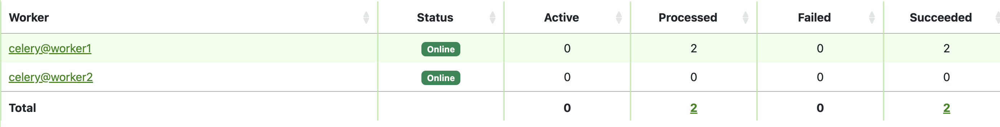

## 프로젝트 정보

Celery에서 메시지 브로커를 Redis를 사용할 경우 발생할 수 있는 문제에 대해서 테스트를 위한 프로젝트

## 사용법

### 프로젝트 세팅 및 실행 방법

```bash
# 가상 환경 및 파이썬 패키지 설치
conda create -n celery-test python=3.11
conda activate celery-test
pip install -r requirements.txt

#프로젝트 이동
cd app

# .env_sample 파일명 변경
mv .env_sample .env

# docker 실행(redis)
docker-compose up -d

# 스크립트 실행 (celery worker 및 flower 실행)
run_celery.sh 2
```

# 테스트

## eta 테스트

task 실행시 [eta](https://docs.celeryq.dev/en/stable/glossary.html#term-ETA)인자로 날짜 및 시간이 주어지면 해당 시각에 task가 실행 된다.

일반적으로 생각하기에는 그 시간 이후에 실행된다고 생각하지만 그렇지 않다.

왜냐하면 Celery에서 브로커로 Redis사용시 AMQP를 모사해서 작동한다.

그 방법은 visibility timeout 이라는 시간 만큼 시간이 지나면 무조건 실패했다고 가정하고, 다시 message를 보낸다.

eat 값이 너무 크면 해당 task는 중복 실행가능 성이 있다.
visibility timeout 기본 값은 1시간이다.
해당 프로젝트에서는 테스트를 위해 5초로 줄였다.

> AMQP에 대한 보충 설명이 필요함

### 실행 방법

```
# 첫번째 인자는 현재로 부터 실행 시점 (초)
# 두번째 인자는 터미널에 출력하기 위한 값
python manage.py task_eta_test 120 "CELERY"
```

### 결과

실행

```
python manage.py task_eta_test 120 "CELERY"

Successfully Excute Task name: CELERY expected excute time: 2023-07-29 16:07:28.685025
```

worker
하나의 message를 보냈는데, 동일한 task가 실행된 현상

```
[2023-07-29 16:05:28,746] Task tasktest.tasks.run_task[b9a9eaf6-aa03-4b43-9d42-e633c076a48d] received

[2023-07-29 16:06:49,530] Task tasktest.tasks.run_task[b9a9eaf6-aa03-4b43-9d42-e633c076a48d] received

[2023-07-29 16:07:28,690: INFO/ForkPoolWorker-1] [celery@worker1-b9a9eaf6-aa03-4b43-9d42-e633c076a48d]  SUCCESS NAME: CELERY

[2023-07-29 16:07:28,692: INFO/ForkPoolWorker-8] [celery@worker1-b9a9eaf6-aa03-4b43-9d42-e633c076a48d]  SUCCESS NAME: CELERY

[2023-07-29 16:07:28,710: INFO/ForkPoolWorker-1] Task tasktest.tasks.run_task
[b9a9eaf6-aa03-4b43-9d42-e633c076a48d] succeeded in 0.02091304212808609s: None

[2023-07-29 16:07:28,710: INFO/ForkPoolWorker-8] Task tasktest.tasks.run_task[b9a9eaf6-aa03-4b43-9d42-e633c076a48d] succeeded in 0.020860582822933793s: None
```

flower로 확인

`localhost:5555` 로 접속
1개의 message만 보냈는데, 2개의 task가 실행된것을 확인할 수 있다.



### 참고

- [Eta 및 countdown](https://docs.celeryq.dev/en/stable/userguide/calling.html#eta-and-countdown)
- [Visibility timeout](https://docs.celeryq.dev/en/stable/getting-started/backends-and-brokers/redis.html#id1)
- [Celery ETA Tasks Demystified](https://engineering.instawork.com/celery-eta-tasks-demystified-424b836e4e94)
- [AMQP - 위키백과](https://ko.wikipedia.org/wiki/AMQP)
